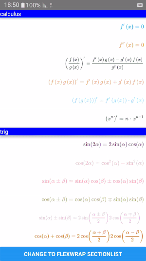

# react-native-math-view

| Launch Test | Example App |
| --- | --- |
|  |  |


## WIP V2

A react native view used to easily display and handle math.

## Installation

`npm install --save react-native-math-view`

**OR**

`yarn add react-native-math-view`


## Getting Started

### Setting up `MathProvider`

`index.js`

```js

import {AppRegistry} from 'react-native';
import App from './App';
import { name as appName } from './app.json';
+ import { MathProviderHOC } from 'react-native-math-view';

- AppRegistry.registerComponent(appName, () => App);
+ AppRegistry.registerComponent(appName, () => MathProviderHOC(App));

```

**OR**

`App.js`

```js
import MathView, { MathProvider } from 'react-native-math-view';

//	use inside render
render() {
  return (
    ...
    
    	// Android only:
    	// Android MathView depends on MathProvider.Provider to function
    	// Render this element once (you can render more) at the top of your app as soon as possible
    	(it takes 3s-5s to get the Provider running)
	//iOS MathProvider.Provider is a stub
	
    <MathProvider.Provider
    	// Use `preload` to enhance performance. To make this work install '@react-native-community/async-storage
        preload={['\\cos\\left(x\\right)=\\frac{b}{c}']}
	
	// get an instance of MathProvider.CacheManager
	ref={ref => ref && ref.setMaxTimeout(8000)}
    >
    ...
    
    </MathProvider.Provider>
    
    ...
  );
}


```

### Rendering `MathView`
```js
import MathView, { MathProvider } from 'react-native-math-view';

render() {
  return (
    ...
    	<MathView
		resizeMode='stretch'
		source={{ math: 'x=\\frac{-b\\pm\\sqrt{b^2-4ac}}{2a}' }}
	/> 
	<MathView
		scaleToFit
		source={{ math: '\\cos\\left(x\\right)=\\frac{b}{c}' }}
	/> 
    ...
  );
}


```

### Using Global `CacheManager`
```js
import MathView, { MathProvider } from 'react-native-math-view';

//	call this method if you want to clear up storage space
//	this method is called internally once AsyncStorage throws an out-of-memory error
MathProvider.CacheManager.clearCache();

```

## Running example app
from the project's directory run:
```
cd MathExample
yarn --production=false
yarn react-native start
```

## Implementation:
  - [ ] [iOS native MathView](https://github.com/kostub/iosMath) - linked native! Need to create RN component

  - [x] Android MathView - **native since V2**, based on [Android SVGImageView](https://bigbadaboom.github.io/androidsvg). Need to implement `editable` state.

### FollowUp

[KaTeX](https://github.com/Khan/KaTeX) - Math keypad that works with `<WebView>`. See [this](https://github.com/ShaMan123/math-input)

[React with LaTeX](https://github.com/Pomax/BezierInfo-2) - using server side rendering to speed things up.

[Writing math dynamically](https://github.com/nicolewhite/algebra.js)

