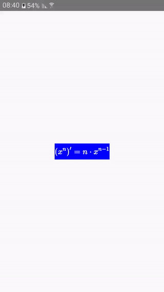
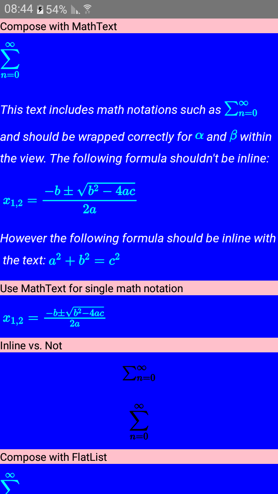

# react-native-math-view

[](https://www.npmjs.com/package/react-native-math-view)

## WIP V3

A react native view used to easily display and handle math. 
The library doesn't use `WebView`.

| MathView Example | Lists Example | MathText |
| --- | --- | --- |
|  |  |  |


## Installation

`npm install --save react-native-math-view` **OR** `yarn add react-native-math-view`

`react-native` > 0.59

#### iOS: 
Install `react-native-svg`

```bash
$ cd ios && pod install
```

#### Expo
Expo doesn't support native modules. 
You can use this library with `react-native-svg` (performance suffers a bit), see [#19](/../../issues/19#issuecomment-567918194).


#### Errors during installation:
1. Upgrade `typescript`
1. If you're getting an error regarging `compileMathjax` you can disregard it as long as `compiled mathjax successfully` was printed to the console. If you're using `yarn` it's probable no logging will show.<br />
1. To be sure everything is compiled properly run the following command from the `mathjax-full` `node_module` directory of your project:
```bash
npm run compile
```
`typescript` errors can be safely disregareded.
<br />see also [#16](/../../issues/16)

## Getting Started

```tsx
import MathView, { MathText } from 'react-native-math-view';

  return (
    ...
    	<MathView
	   math={'x=\\frac{-b\\pm\\sqrt{b^2-4ac}}{2a}'}
	/> 
	<MathView
	   math='\cos\left(x\right)=\frac{b}{c}'
	/> 
	<MathView
	   math='\cos\left(x=\frac{b}{c}'
	   renderError={({ error }) => <Text style={[{ fontWeight: 'bold' }]}>{error}</Text>}
	/> 
	<MathText
            value={`This text includes math notations and should be wrapped correctly for \\( \\alpha \\) and $\\beta$ within the view. \nThe following formula shouldn't be inline:$$x_{1,2} = {-b \\pm \\sqrt{b^2-4ac} \\over 2a}$$However the following formula should be inline with the text: \\( a^2 + b^2 = c^2 \\)`}
            direction="ltr"
            CellRendererComponent={<TouchableOpacity />}
        />
    ...
  );


```

## TroubleShooting

1. Make sure to properly escape all `LaTeX` strings (Syntax sensitive):

This occurs because when passing `math={value}`, `value` gets evaluated as opposed to `math='LaTeX'`. 
<br />It is cosidered best practice to avoid using `math='LaTeX'`.

```diff
        <MathView
-	   math='x=\\frac{-b\\pm\\sqrt{b^2-4ac}}{2a}'
+	   math='x=\frac{-b\pm\sqrt{b^2-4ac}}{2a}'
	/> 
	
	//	OR
	
        <MathView
-	   math={'x=\frac{-b\pm\sqrt{b^2-4ac}}{2a}'}
+	   math={'x=\\frac{-b\\pm\\sqrt{b^2-4ac}}{2a}'}
	/> 
```

2. Try your `LaTeX` in the `MathJax` [sandbox](https://www.mathjax.org/#demo).
<br />You can run `setMode('SVG')` from dev console in order to render svg.

## Running example app
From the project's directory run:
```
yarn --production=false
cd MathExample
yarn --production=false
npm run android
```

### [MathJax Supported LaTeX Commands](https://docs.mathjax.org/en/v1.0/tex.html#supported-latex-commands)


## Implementation:
  - [ ] [iOS native MathView](https://github.com/kostub/iosMath) - POC successful, need to implement native measuring. For now fallbacking to `react-native-svg`

  - [x] Android MathView - **native since V2**, based on [Android SVGImageView](https://bigbadaboom.github.io/androidsvg). Need to implement `editable` state.
  
## Looking for Web support?
Check out [react-math-view](https://github.com/ShaMan123/react-math-view#react-math-view)!

### FollowUp

[iOS editable math view](https://github.com/kostub/MathEditor)

[Native android math view](https://github.com/himamis/ReTeX)

[Web Math Editors](https://github.com/mathjax/MathJax-docs/wiki/List-of-web-based-math-editors) -> [**MathLive**](https://github.com/arnog/mathlive) looks very promising!

[KaTeX](https://github.com/Khan/KaTeX) - Math keypad that works with `<WebView>`. See [this](https://github.com/ShaMan123/math-input)

[React with LaTeX](https://github.com/Pomax/BezierInfo-2) - using server side rendering to speed things up.

[Writing math dynamically](https://github.com/nicolewhite/algebra.js)

[SSR]:
(https://latex.codecogs.com/svg.latex?\Large&space;x=\frac{-b\pm\sqrt{b^2-4ac}}{2a})


